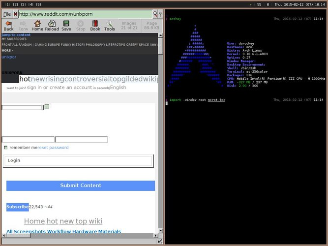

dotfiles
========

Install
-------

```
git clone https://github.com/darookee/dotfiles .dotfiles
cd .dotfiles
./setup.sh
```

Update
------

```
cd ~/.dotfiles
git pull --rebase
./setup.sh update
```

X
--

Looks like this:

